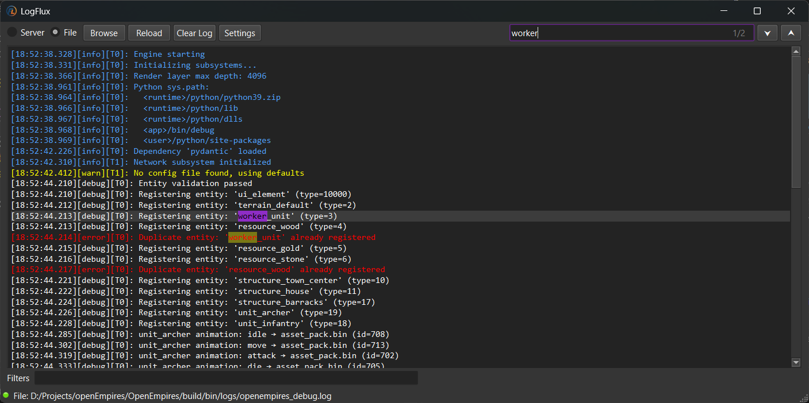
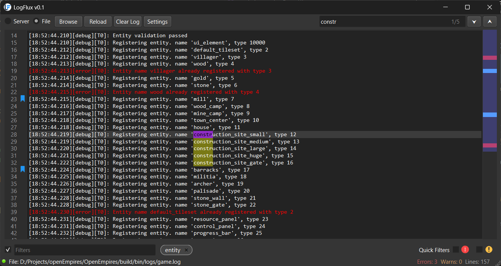

# LogFlux
Network and File log viewer.

<p align="center">
  
</p>

<p align="center">
    
    
    
    <a href="https://discord.gg/zTGvvhVm">
        
    </a>
</p>

## Overview
LogFlux is a lightweight desktop application for viewing and following log data from local files and as a network server in real time. It is implemented in modern C++ with a Qt-based user interface and focuses on fast navigation, searching, filtering, tailing, and a compact keyboard-friendly UI.




## Features
- Open and tail local log files
- Hosting TCP server for accepting newline delimited log lines
- Searching and iterating through search results
- Filtering log based on AND, OR conditions
- Quick filters for errors and warnings
- Bookmarking log lines
- Stats; total lines, errors, and warnings
- Minimap based scrolling
- less/vim inspired keyboard navigations
    - **ctrl+f** search the log                         
    - **e** go to next error                       
    - **shift+e** go to previous error
    - **enter (inside search)** go to next search result               
    - **shift+enter (inside search)** go to previous search result           
    - **w** go to next warning
    - **shift+w** go to previous warning
    - **n (inside logview)** go to next search result               
    - **shift+n (inside logview)** go to previous search result           
    - **space** scroll down by one page
    - **shift+space** scroll up by one page
    - **g** go to start of the log                 
    - **shift+g** go to end of the log (and tail)        
    - **m** bookmark current line
    - **b** go to next bookmark
    - **shift+b** go to previous bookmark


## Usage
To use LogFlux, simply launch the application and navigate to the desired log file or use network (TCP) server. Utilize the available keyboard shortcuts to navigate the log. By default LogFlux will host a TCP server at 5000 and listen to any new line delimited log lines in the server mode. You can have a log sinker in your application to connect to this server and send log lines, or as a separate agent to poll log file and send over network. Or simply open the same log file in LogFlux and it will keep tailing the file.

### Example spdlog sink
```cpp
spdlog::sinks::tcp_sink_config tcpConfig("localhost", 5000);
tcpConfig.lazy_connect = true;
tcpConfig.timeout_ms = 10;
auto tcpSink = std::make_shared<spdlog::sinks::tcp_sink_mt>(tcpConfig);

spdlog::sinks_init_list sinks{consoleSink, fileSink, tcpSink};

spdlog::init_thread_pool(8192, 1);
auto logger = std::make_shared<spdlog::async_logger>("multi_sink", sinks, spdlog::thread_pool(),
                                                     spdlog::async_overflow_policy::block);

spdlog::set_default_logger(logger);
```

> NOTE: You might want to use async loggers or use timeouts to prevent application gettting blocked if the LogFlux is not launched.

## Technology & Dependencies
LogFlux is built using the following technologies:
- **Programming Language**: C++17
- **UI / Framework**: Qt 6 (QtCore, QtGui, QtWidgets, QtNetwork)
- **Build System**: CMake (minimum required: 3.16; tested with 3.31.6-msvc6)
- **Generator**: Ninja (recommended)
- **Toolchain**: Microsoft Visual Studio 2022 (MSVC)
- **Optional**: Python 3 (only for the test helper script `tests/send_logs.py`)

### Build Instructions (Windows, MSVC + Ninja)
Once the dependencies are installed and discoverable, follow  cmake steps to build the project. Easiest alternative is to open the project in Visual Studio with Qt VS Tool addon installed.

## Running the Test Sender
A small Python script exists at `tests/send_logs.py` to push sample log lines to the network source for manual testing. Python is not required for the application itself.

python tests/send_logs.py

## Contributing

Contributions of all sizes are welcome — whether it's fixing a typo, improving the UI, reporting bugs, suggesting ideas, or implementing new features.

If you're looking for something to work on, here are a few areas that could use help:

### Ideas & Areas for Contribution
- Configurable dark/light themes
- Lazy loading for large log files
- Quick filters for bookmarks
- Command line argument support
- Additional network protocols and formats
